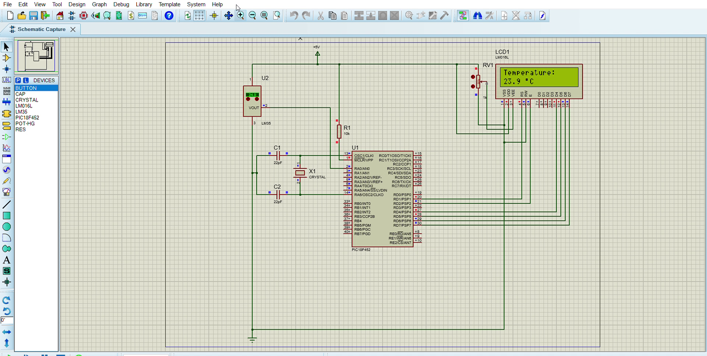

# Temperature Monitoring Circuit — PIC18F452 + LM35 (Proteus Simulation)

Undergraduate group project for **EEE572** (Electrical/Electronics Engineering)

University of Benin, supervised by Dr. Scott Idubor.

**_Submitted: September 26, 2025_**

A real-time temperature monitoring system built around the **LM35** analog
temperature sensor and a **PIC18F452** microcontroller, with live readings
displayed on a 16x2 character LCD. The full circuit was designed, coded, and
simulated in **Proteus 8 Professional**, with firmware written in **mikroC
PRO for PIC**.

## Demo

*(Shortened preview — see [`demo/`](demo) or the note below for the full capture.)*

## How it works

1. The LM35 outputs an analog voltage proportional to temperature
   (10 mV/°C) into the PIC18F452's analog input (AN0).
2. The microcontroller's built-in ADC samples this voltage and converts it
   to a 10-bit digital value.
3. Firmware converts the ADC reading to a Celsius value:
   `temperature = (adc_value * 500.0) / 1023.0`
4. The result is formatted and written to a 16x2 LCD in real time, refreshed
   every 500 ms.

## Repository structure

| Path | Description |
|---|---|
| [`src/temperature_monitor.c`](src/temperature_monitor.c) | mikroC PRO for PIC source code |
| [`firmware/Temperature_circuit.HEX`](firmware) | Compiled HEX file, loadable directly into the PIC in Proteus |
| [`simulation/Temperature_circuit.pdsprj`](simulation) | Proteus 8 Professional project file (schematic + simulation) |
| [`docs/Temperature Sensor Report.pdf`](docs) | Full project report: background, methodology, and results |
| [`demo/`](demo) | Simulation walkthrough (GIF preview / video) |

## Tools & components

- Proteus 8 Professional (schematic capture & simulation)
- mikroC PRO for PIC (firmware)
- PIC18F452 microcontroller
- LM35 analog temperature sensor
- 16x2 character LCD
- Supporting passives: resistors, capacitors, crystal, potentiometer (LCD contrast)

## Running the simulation

1. Install [Proteus 8 Professional](https://www.labcenter.com/) (or newer).
2. Open [`simulation/Temperature_circuit.pdsprj`](simulation/Temperature_circuit.pdsprj).
3. The compiled [`firmware/Temperature_circuit.HEX`](firmware/Temperature_circuit.HEX)
   is already attached to the PIC18F452 in the project — press **Play** to
   start the simulation.
4. Adjust the LM35's simulated voltage/temperature source to see the LCD
   reading update live.

To modify the firmware, edit [`src/temperature_monitor.c`](src/temperature_monitor.c)
in mikroC PRO for PIC, recompile, and reload the generated `.hex` file into
the Proteus project.

## Author

Course: EEE572 — Electrical/Electronics Engineering, University of Benin
Lecturer: Dr. Scott Idubor
